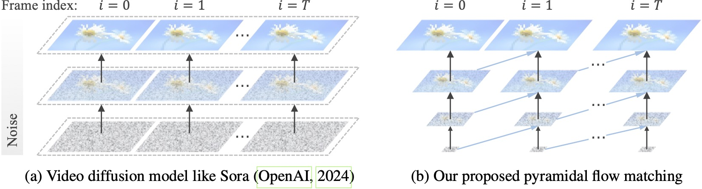
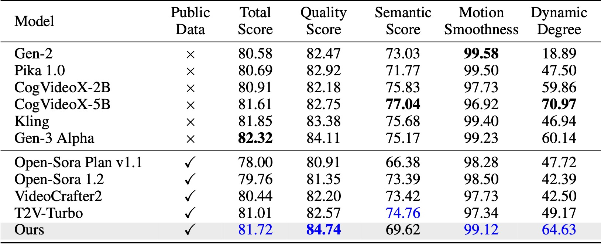
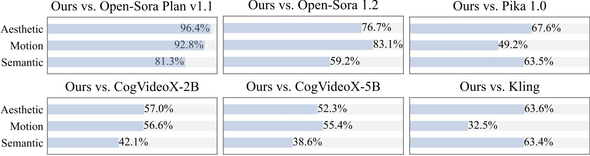

<div align="center">

# ⚡️Pyramid Flow⚡️

[[Paper]](https://arxiv.org/abs/2410.05954) [[Project Page ✨]](https://pyramid-flow.github.io) [[Model 🚀]](https://huggingface.co/rain1011/pyramid-flow-sd3) [[demo 🤗](https://huggingface.co/spaces/Pyramid-Flow/pyramid-flow)]

</div>

This is the official repository for Pyramid Flow, a training-efficient **Autoregressive Video Generation** method based on **Flow Matching**. By training only on **open-source datasets**, it can generate high-quality 10-second videos at 768p resolution and 24 FPS, and naturally supports image-to-video generation.

<table class="center" border="0" style="width: 100%; text-align: left;">
<tr>
  <th>10s, 768p, 24fps</th>
  <th>5s, 768p, 24fps</th>
  <th>Image-to-video</th>
</tr>
<tr>
  <td><video src="https://github.com/user-attachments/assets/9935da83-ae56-4672-8747-0f46e90f7b2b" autoplay muted loop playsinline></video></td>
  <td><video src="https://github.com/user-attachments/assets/3412848b-64db-4d9e-8dbf-11403f6d02c5" autoplay muted loop playsinline></video></td>
  <td><video src="https://github.com/user-attachments/assets/3bd7251f-7b2c-4bee-951d-656fdb45f427" autoplay muted loop playsinline></video></td>
</tr>
</table>

## News

* `COMING SOON` ⚡️⚡️⚡️ Training code for both the Video VAE and DiT; New model checkpoints trained from scratch.
  
  > We are training Pyramid Flow from scratch to fix human structure issues related to the currently adopted SD3 initialization and hope to release it in the next few days.
* `2024.10.13`  ✨✨✨ [Multi-GPU inference](#3-multi-gpu-inference) and [CPU offloading](#cpu-offloading) are supported. Use it with **less than 8GB** of GPU memory, with great speedup on multiple GPUs.
* `2024.10.11`  🤗🤗🤗 [Hugging Face demo](https://huggingface.co/spaces/Pyramid-Flow/pyramid-flow) is available. Thanks [@multimodalart](https://huggingface.co/multimodalart) for the commit! 
* `2024.10.10`  🚀🚀🚀 We release the [technical report](https://arxiv.org/abs/2410.05954), [project page](https://pyramid-flow.github.io) and [model checkpoint](https://huggingface.co/rain1011/pyramid-flow-sd3) of Pyramid Flow.

## Introduction



Existing video diffusion models operate at full resolution, spending a lot of computation on very noisy latents. By contrast, our method harnesses the flexibility of flow matching ([Lipman et al., 2023](https://openreview.net/forum?id=PqvMRDCJT9t); [Liu et al., 2023](https://openreview.net/forum?id=XVjTT1nw5z); [Albergo & Vanden-Eijnden, 2023](https://openreview.net/forum?id=li7qeBbCR1t)) to interpolate between latents of different resolutions and noise levels, allowing for simultaneous generation and decompression of visual content with better computational efficiency. The entire framework is end-to-end optimized with a single DiT ([Peebles & Xie, 2023](http://openaccess.thecvf.com/content/ICCV2023/html/Peebles_Scalable_Diffusion_Models_with_Transformers_ICCV_2023_paper.html)), generating high-quality 10-second videos at 768p resolution and 24 FPS within 20.7k A100 GPU training hours.

## Installation

We recommend setting up the environment with conda. The codebase currently uses Python 3.8.10 and PyTorch 2.1.2, and we are actively working to support a wider range of versions.

```bash
git clone https://github.com/jy0205/Pyramid-Flow
cd Pyramid-Flow

# create env using conda
conda create -n pyramid python==3.8.10
conda activate pyramid
pip install -r requirements.txt
```

Then, you can directly download the model from [Huggingface](https://huggingface.co/rain1011/pyramid-flow-sd3). We provide both model checkpoints for 768p and 384p video generation. The 384p checkpoint supports 5-second video generation at 24FPS, while the 768p checkpoint supports up to 10-second video generation at 24FPS.

```python
from huggingface_hub import snapshot_download

model_path = 'PATH'   # The local directory to save downloaded checkpoint
snapshot_download("rain1011/pyramid-flow-sd3", local_dir=model_path, local_dir_use_symlinks=False, repo_type='model')
```

## Usage

### 1. Quick start with Gradio

To get started, first install [Gradio](https://www.gradio.app/guides/quickstart), set your model path at [#L32](https://github.com/jy0205/Pyramid-Flow/blob/dc07dbf9594d6f81ce8e382ecf70e16dbda252c0/app.py#L32), and then run on your local machine:

```bash
python app.py
```

The Gradio demo will be opened in a browser. Thanks to [@tpc2233](https://github.com/tpc2233) the commit, see [#48](https://github.com/jy0205/Pyramid-Flow/pull/48) for details.

Or, try it out effortlessly on [Hugging Face Space 🤗](https://huggingface.co/spaces/Pyramid-Flow/pyramid-flow) created by [@multimodalart](https://huggingface.co/multimodalart). Due to GPU limits, this online demo can only generate 25 frames (export at 8FPS or 24FPS). Duplicate the space to generate longer videos.

### 2. Inference Code

To use our model, please follow the inference code in `video_generation_demo.ipynb` at [this link](https://github.com/jy0205/Pyramid-Flow/blob/main/video_generation_demo.ipynb). We further simplify it into the following two-step procedure. First, load the downloaded model:

```python
import torch
from PIL import Image
from pyramid_dit import PyramidDiTForVideoGeneration
from diffusers.utils import load_image, export_to_video

torch.cuda.set_device(0)
model_dtype, torch_dtype = 'bf16', torch.bfloat16   # Use bf16 (not support fp16 yet)

model = PyramidDiTForVideoGeneration(
    'PATH',                                         # The downloaded checkpoint dir
    model_dtype,
    model_variant='diffusion_transformer_768p',     # 'diffusion_transformer_384p'
)


model.vae.enable_tiling()
# model.vae.to("cuda")
# model.dit.to("cuda")
# model.text_encoder.to("cuda")

# if you're not using sequential offloading bellow uncomment the lines above ^
model.enable_sequential_cpu_offload()
```

Then, you can try text-to-video generation on your own prompts:

```python
prompt = "A movie trailer featuring the adventures of the 30 year old space man wearing a red wool knitted motorcycle helmet, blue sky, salt desert, cinematic style, shot on 35mm film, vivid colors"

with torch.no_grad(), torch.cuda.amp.autocast(enabled=True, dtype=torch_dtype):
    frames = model.generate(
        prompt=prompt,
        num_inference_steps=[20, 20, 20],
        video_num_inference_steps=[10, 10, 10],
        height=768,     
        width=1280,
        temp=16,                    # temp=16: 5s, temp=31: 10s
        guidance_scale=9.0,         # The guidance for the first frame, set it to 7 for 384p variant
        video_guidance_scale=5.0,   # The guidance for the other video latent
        output_type="pil",
        save_memory=True,           # If you have enough GPU memory, set it to `False` to improve vae decoding speed
    )

export_to_video(frames, "./text_to_video_sample.mp4", fps=24)
```

As an autoregressive model, our model also supports (text conditioned) image-to-video generation:

```python
image = Image.open('assets/the_great_wall.jpg').convert("RGB").resize((1280, 768))
prompt = "FPV flying over the Great Wall"

with torch.no_grad(), torch.cuda.amp.autocast(enabled=True, dtype=torch_dtype):
    frames = model.generate_i2v(
        prompt=prompt,
        input_image=image,
        num_inference_steps=[10, 10, 10],
        temp=16,
        video_guidance_scale=4.0,
        output_type="pil",
        save_memory=True,           # If you have enough GPU memory, set it to `False` to improve vae decoding speed
    )

export_to_video(frames, "./image_to_video_sample.mp4", fps=24)
```

#### CPU offloading

We also support two types of CPU offloading to reduce GPU memory requirements. Note that they may sacrifice efficiency.
* Adding a `cpu_offloading=True` parameter to the generate function allows inference with **less than 12GB** of GPU memory. This feature was contributed by [@Ednaordinary](https://github.com/Ednaordinary), see [#23](https://github.com/jy0205/Pyramid-Flow/pull/23) for details.
* Calling `model.enable_sequential_cpu_offload()` before the above procedure allows inference with **less than 8GB** of GPU memory. This feature was contributed by [@rodjjo](https://github.com/rodjjo), see [#75](https://github.com/jy0205/Pyramid-Flow/pull/75) for details.

#### MPS backend

Thanks to [@niw](https://github.com/niw), Apple Silicon users (e.g. MacBook Pro with M2 24GB) can also try our model using the MPS backend! Please see https://github.com/jy0205/Pyramid-Flow/pull/113 for the details.

### 3. Multi-GPU Inference

For users with multiple GPUs, we provide an [inference script](https://github.com/jy0205/Pyramid-Flow/blob/main/scripts/inference_multigpu.sh) that uses sequence parallelism to save memory on each GPU. This also brings a big speedup, taking only 2.5 minutes to generate a 5s, 768p, 24fps video on 4 A100 GPUs (vs. 5.5 minutes on a single A100 GPU). Run it on 2 GPUs with the following command:

```bash
CUDA_VISIBLE_DEVICES=0,1 sh scripts/inference_multigpu.sh
```

It currently supports 2 or 4 GPUs, with more configurations available in the original script. You can also launch a [multi-GPU Gradio demo](https://github.com/jy0205/Pyramid-Flow/blob/main/scripts/app_multigpu_engine.sh) created by [@tpc2233](https://github.com/tpc2233), see [#59](https://github.com/jy0205/Pyramid-Flow/pull/59) for details.

  > Spoiler: We didn't even use sequence parallelism in training, thanks to our efficient pyramid flow designs. Stay tuned for the training code.

## Usage tips

* The `guidance_scale` parameter controls the visual quality. We suggest using a guidance within [7, 9] for the 768p checkpoint during text-to-video generation, and 7 for the 384p checkpoint.
* The `video_guidance_scale` parameter controls the motion. A larger value increases the dynamic degree and mitigates the autoregressive generation degradation, while a smaller value stabilizes the video.
* For 10-second video generation, we recommend using a guidance scale of 7 and a video guidance scale of 5.

## Gallery

The following video examples are generated at 5s, 768p, 24fps. For more results, please visit our [project page](https://pyramid-flow.github.io).

<table class="center" border="0" style="width: 100%; text-align: left;">
<tr>
  <td><video src="https://github.com/user-attachments/assets/5b44a57e-fa08-4554-84a2-2c7a99f2b343" autoplay muted loop playsinline></video></td>
  <td><video src="https://github.com/user-attachments/assets/5afd5970-de72-40e2-900d-a20d18308e8e" autoplay muted loop playsinline></video></td>
</tr>
<tr>
  <td><video src="https://github.com/user-attachments/assets/1d44daf8-017f-40e9-bf18-1e19c0a8983b" autoplay muted loop playsinline></video></td>
  <td><video src="https://github.com/user-attachments/assets/7f5dd901-b7d7-48cc-b67a-3c5f9e1546d2" autoplay muted loop playsinline></video></td>
</tr>
</table>

## Comparison

On VBench ([Huang et al., 2024](https://huggingface.co/spaces/Vchitect/VBench_Leaderboard)), our method surpasses all the compared open-source baselines. Even with only public video data, it achieves comparable performance to commercial models like Kling ([Kuaishou, 2024](https://kling.kuaishou.com/en)) and Gen-3 Alpha ([Runway, 2024](https://runwayml.com/research/introducing-gen-3-alpha)), especially in the quality score (84.74 vs. 84.11 of Gen-3) and motion smoothness.



We conduct an additional user study with 20+ participants. As can be seen, our method is preferred over open-source models such as [Open-Sora](https://github.com/hpcaitech/Open-Sora) and [CogVideoX-2B](https://github.com/THUDM/CogVideo) especially in terms of motion smoothness.



## Acknowledgement

We are grateful for the following awesome projects when implementing Pyramid Flow:

* [SD3 Medium](https://huggingface.co/stabilityai/stable-diffusion-3-medium) and [Flux 1.0](https://huggingface.co/black-forest-labs/FLUX.1-dev): State-of-the-art image generation models based on flow matching.
* [Diffusion Forcing](https://boyuan.space/diffusion-forcing) and [GameNGen](https://gamengen.github.io): Next-token prediction meets full-sequence diffusion.
* [WebVid-10M](https://github.com/m-bain/webvid), [OpenVid-1M](https://github.com/NJU-PCALab/OpenVid-1M) and [Open-Sora Plan](https://github.com/PKU-YuanGroup/Open-Sora-Plan): Large-scale datasets for text-to-video generation.
* [CogVideoX](https://github.com/THUDM/CogVideo): An open-source text-to-video generation model that shares many training details.
* [Video-LLaMA2](https://github.com/DAMO-NLP-SG/VideoLLaMA2): An open-source video LLM for our video recaptioning.

## Citation

Consider giving this repository a star and cite Pyramid Flow in your publications if it helps your research.
```
@article{jin2024pyramidal,
  title={Pyramidal Flow Matching for Efficient Video Generative Modeling},
  author={Jin, Yang and Sun, Zhicheng and Li, Ningyuan and Xu, Kun and Xu, Kun and Jiang, Hao and Zhuang, Nan and Huang, Quzhe and Song, Yang and Mu, Yadong and Lin, Zhouchen},
  jounal={arXiv preprint arXiv:2410.05954},
  year={2024}
}
```
